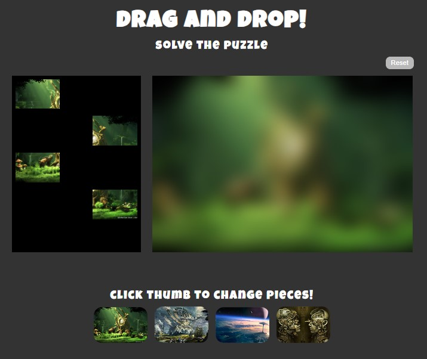

# Nathalia Lima - Drag and Drop Puzzle
This repo is for Multimedia Authoring 2 Project - Drag and Drop Puzzle

___

## About the project

This website is a puzzle with 4 different images that the user can select and solve.

Several errors were encountered during the creation process and are listed below along with the requirements.
All errors have been corrected in the latest version released on Feb 29, 2024.

The user can pick any of the 4 puzzle pieces and drag and drop the piece into a drop-zone

The user should only be able to drag and drop one piece into any given drop-zone.

    Problem #1:

    The puzzle is allowing to place more than one piece in the same spot.

    Ideas for solution:

    Check how many children the spot where the user dropped a piece has.

    If there's more than one piece, don't allow the drop.

    Solution attempts:

    if (this.children.length == 0) {
            this.appendChild(draggedPiece);
        } else {
            console.log('no');
    }

    Bonus: Show a message that there's already a piece in the spot.
	
The user should be able to select any of the 4 background images at the bottom to change the puzzle board background image.

Problem #2:
When changing the background image, the pieces don't change accordingly.
Ideas for solution:
Create a forEach loop to check all children of .puzzle-pieces and change the src id.
Use the same logic as the changeBGImage function, checking the index (for example: index 0 = topLeft) of each child and changing its id
Solution attempts:
puzzlePieces.forEach((piece, index) => {
		if (index === 0) {
			piece.style.backgroundImage = `url(images/topLeft${this.id}.jpg)`;
		} else if (index === 1) {
			piece.style.backgroundImage = `url(images/topRight${this.id}.jpg)`;
		} else if (index === 2) {
			piece.style.backgroundImage = `url(images/bottomLeft${this.id}.jpg)`;
		} else if (index === 3) {
			piece.style.backgroundImage = `url(images/bottomRight${this.id}.jpg)`;
		}
	});

Create a forEach loop to check in each child of .puzzle-pieces the src, and split the string so that the id is automatically altered.
Solution attempts:
function changeBGImage() {
	puzzleBoard.style.backgroundImage = `url(images/backGround${this.id}.jpg)`;

	puzzlePiecesImg.forEach(piece => {
		const jpgPosition = piece.src.indexOf(".jpg");
		const pieceName = piece.src.slice(0, jpgPosition - 1);
		const newName = pieceName + this.id + ".jpg";
		piece.src = newName;
    });
}

When the user selects a new background image the pieces should return to the puzzle pieces area.
Problem #3:
The pieces don't return to their original location (.puzzle-pieces)
Ideas for solution:
Create a function to reset all pieces and call it when a new background is selected and when the reset button is clicked.

Remove the pieces from the .puzzle-board and then insert them again into the .puzzle-pieces.
Create a forEach loop to check in each spot if there's a piece, if so, remove it and then insert it again into the .puzzle-board. 
Solution attempts:
puzzlePieces.forEach(piece => {
       if (puzzleBoard.contains(piece)) {
            puzzleBoard.removeChild(piece);
            puzzlePieces[0].parentNode.appendChild(piece);
        }
});

Instead of deleting the pieces from the .puzzle-board and inserting them again into the .puzzle-pieces, just insert them again into the .puzzle-pieces, creating a forEach loop on the children of .puzzle-pieces and inserting them into the parent.
Solution attempts:
variables:
puzzlePieces = document.querySelector(".puzzle-pieces"),
puzzlePiecesImg = document.querySelectorAll(".puzzle-pieces img"),

function reset() {
    puzzlePiecesImg.forEach(piece => {
        puzzlePieces.appendChild(piece);
    });
}

___

## Installation

There is no installation required.

## Usage

Open index.html in the browser of your choice.

## Contributing

1. Fork it!
2. Create your feature branch: `git checkout -b my-new-feature`
3. Commit your changesL `git commit -am 'Add some feature'`
4. Push to the branch: `git push origin my-new-feature`
5. Submit a pull request :D

## History

February 29, 2024

## Credits

Nathalia Lima

## License

MIT - please see [license file](LICENSE).
